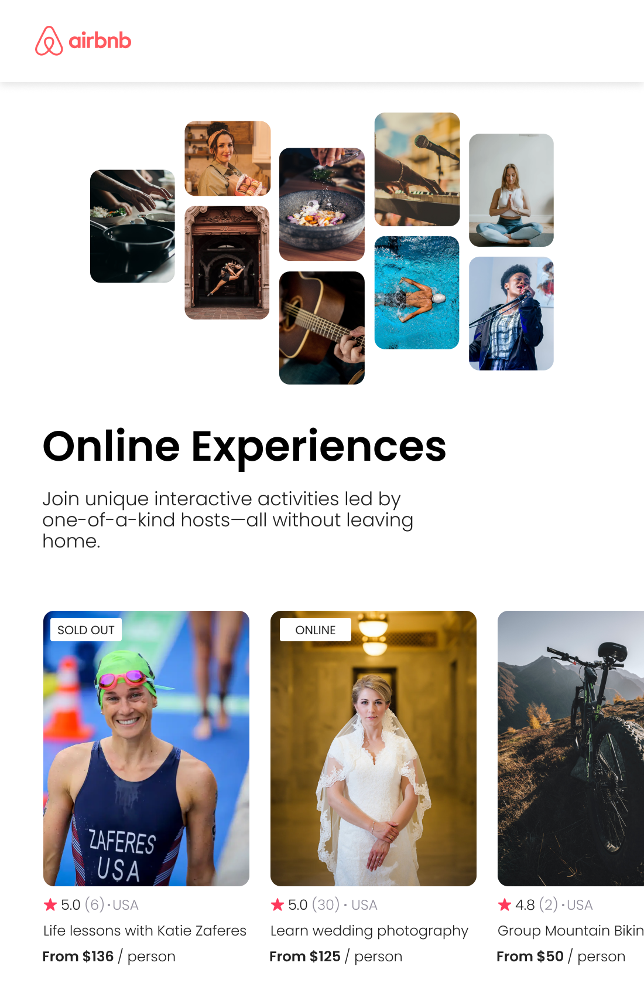

# Airbnb Experiences clone  

## Objective

Welcome to Airbnb Experiences clone built with React! This project was developed to demonstrate the setup of a React project using static and reusable data-driven components.  

## Requirements

- Build a mobile only Airbnb Experiences clone using React according to the <a href="https://www.figma.com/file/nGwev6ALOxfraEPjM6pwSE/Airbnb-Experiences?t=NbHKXoLZZVEf0T5U-1">Figma file</a>
- Reusable Components
- React Props
- array .map()
- Conditional Rendering
- Styling with Classes

### Screenshot
 
